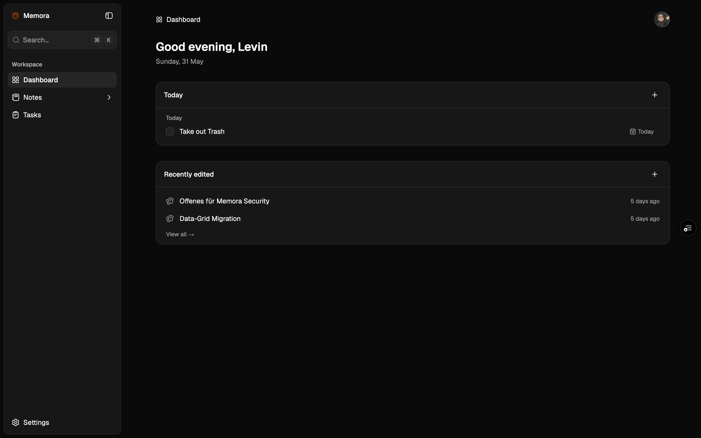
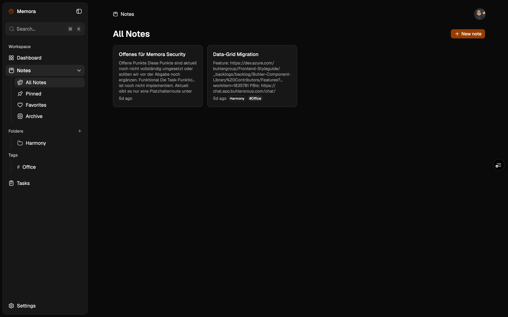
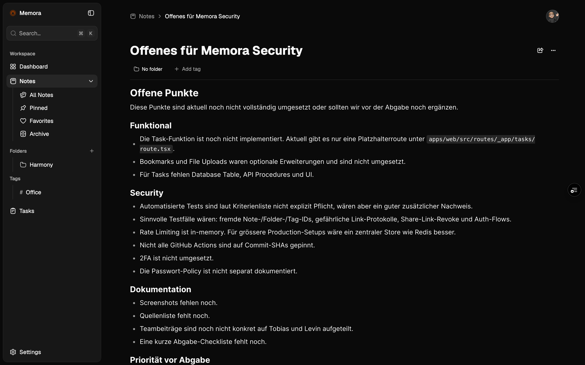
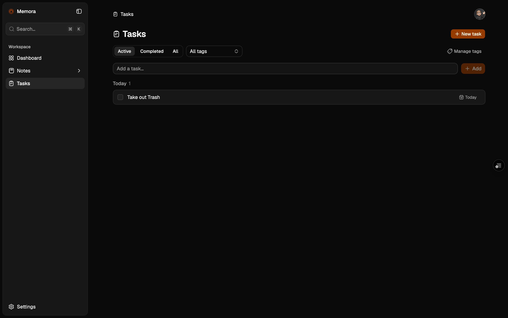
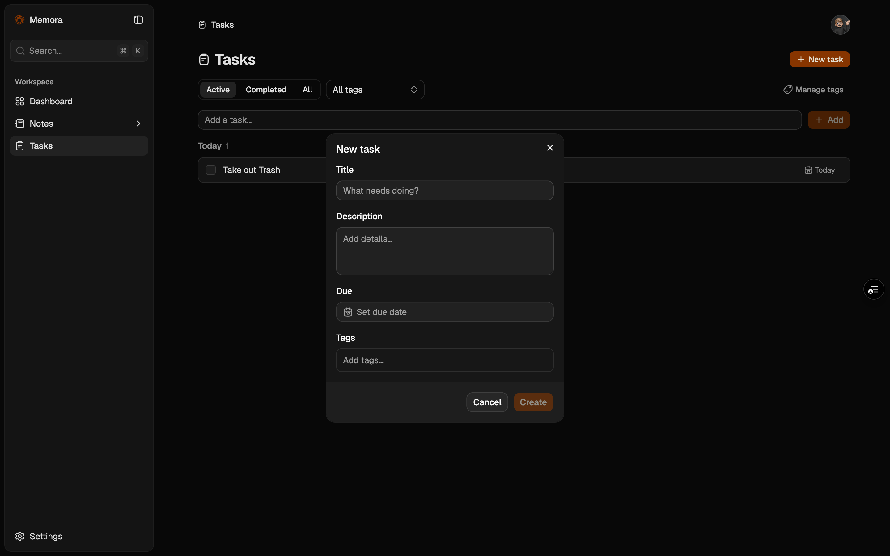
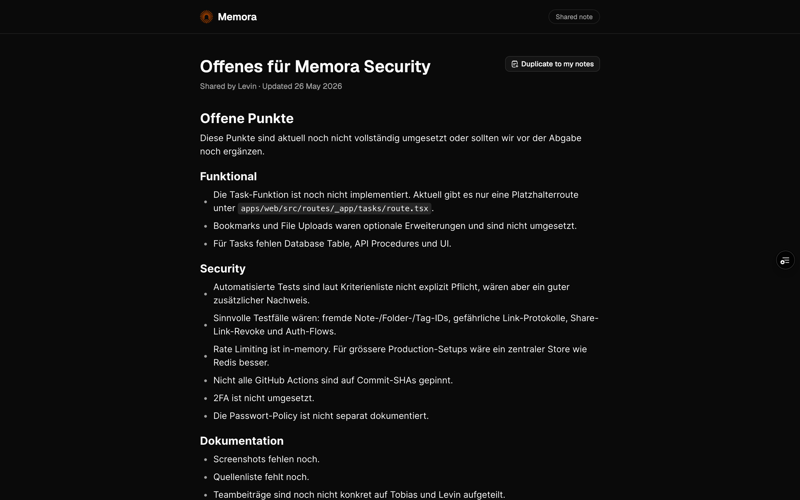
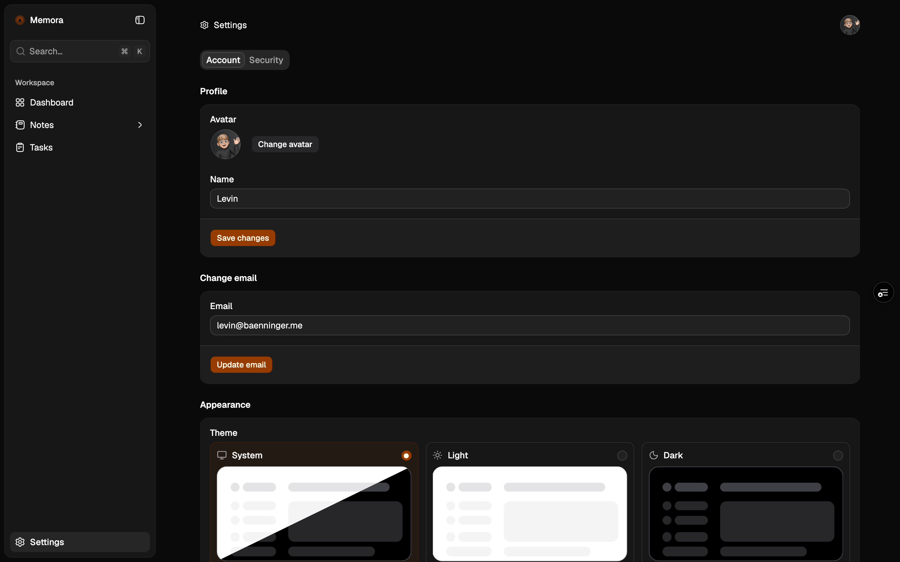
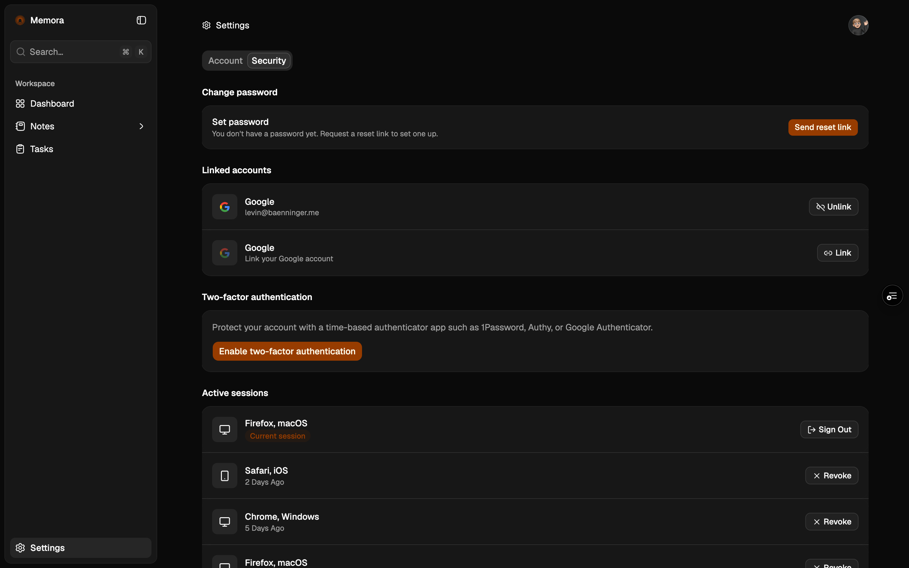

# 1. Konzept & Planung

## App-Idee

Unsere App **Memora** ist ein persönlicher Workspace für Notizen und Tasks. Die Idee dahinter ist ein vereinfachtes Second-Brain-System: Man sammelt wichtige Informationen, strukturiert sie mit Ordnern und Tags und behält gleichzeitig offene Aufgaben im Blick.

Der Fokus liegt bei uns nicht auf möglichst vielen Features, sondern auf einer sauberen Web-App mit nachvollziehbarer Security. Da Notizen und Tasks private Daten enthalten können, müssen Login, Zugriffskontrolle und sichere Eingaben von Anfang an stimmen.

## Geplante Features

Für das Projekt haben wir diese Kernfunktionen geplant:

- Registrierung, Login und Logout
- Notizen erstellen, bearbeiten, archivieren, wiederherstellen und löschen
- Ordner und Tags zur Organisation
- Suche über Notizen und Tasks
- Tasks erstellen, bearbeiten, abschliessen, löschen und mit Tags sowie Fälligkeitsdatum organisieren
- Dashboard mit aktuellen Notizen und heutigen Tasks
- Command Menu mit Suche, Schnellaktionen und Shortcuts
- Profil- und Security-Einstellungen
- Teilen von einzelnen Notizen über Share Links

## Tech Stack

- Framework: TanStack Start mit React
- API: oRPC
- Database: PostgreSQL/Neon mit Drizzle ORM
- Authentication: Better Auth
- Editor: BlockNote
- UI: Tailwind CSS v4, shadcn/ui, Base UI
- E-Mail: React Email und Resend
- Redis: Upstash Redis für Rate Limiting und Auth Secondary Storage
- Tooling: Bun, Turborepo, Ultracite/Biome, Commitlint, Husky, lint-staged
- Security/CI: GitHub Actions, Dependabot, CodeQL

## Warum dieser Stack?

Der Stack besteht grösstenteils aus Technologien, die in modernen Web-Apps sehr typisch sind. React mit TanStack Start eignet sich gut für eine Full-Stack-Web-App, weil damit Benutzeroberfläche, Routing und serverseitige Logik in einem Projekt umgesetzt werden können. Levin kennt sich bereits gut mit TanStack Start, oRPC, Better Auth und Drizzle aus. Dadurch konnten wir schneller arbeiten und trotzdem einen Stack verwenden, der zu einer App mit Login, Formularen, geschützten Seiten und Datenbankzugriffen passt.

oRPC hilft uns dabei, die Kommunikation zwischen Frontend und Backend typensicher zu halten. Das ist praktisch, weil Fehler bei API-Aufrufen früher auffallen und die Schnittstellen klarer bleiben. PostgreSQL mit Drizzle ist eine passende Wahl, weil relationale Datenbanken für User, Notizen, Tasks, Ordner und Tags sehr gut geeignet sind.

Better Auth verwenden wir, weil Authentifizierung in fast jeder Web-App gebraucht wird und sicherheitskritisch ist. Login, Sessions, Passwort-Reset, E-Mail-Verifikation und 2FA sollten nicht komplett selbst gebaut werden. Deshalb ist es sinnvoll, dafür eine bestehende und etablierte Library zu verwenden.

BlockNote nutzen wir für den Editor, weil Memora mehr als einfache Textfelder benötigt und bereits viele Features für uns abdeckt. Für UI und Styling verwenden wir Tailwind CSS, shadcn/ui und Base UI, da solche Komponenten und Utility-Klassen bei modernen Web-Apps sehr verbreitet sind und die Entwicklung schneller sowie einheitlicher machen.

React Email und Resend sind für typische E-Mail-Funktionen wie Verifikation, Passwort-Reset oder Sicherheitsmeldungen vorgesehen. Upstash Redis verwenden wir für Rate Limiting und kurzlebige Auth-Daten. Das ist vor allem bei Login- und Passwort-Reset-Endpunkten wichtig, damit nicht unbegrenzt viele Anfragen gesendet werden können.

Bun, Turborepo, Ultracite/Biome, Commitlint, Husky und lint-staged helfen bei der Projektstruktur und Codequalität. GitHub Actions, Dependabot und CodeQL ergänzen das durch automatische Checks, Dependency-Updates und einfache Security-Analysen.

## Screenshots

